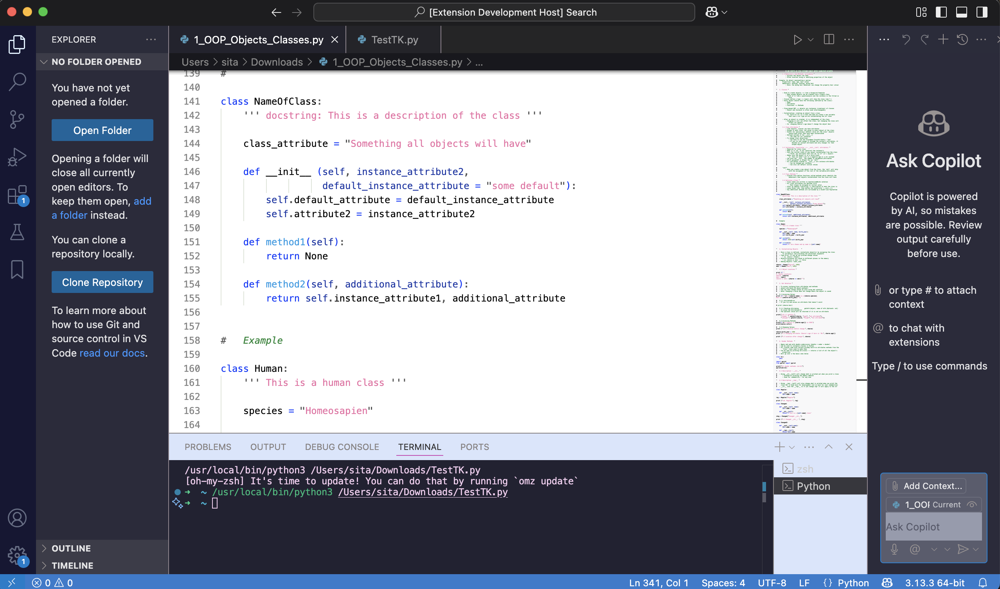

# sita-mix VS Theme README

* A theme for VS Code - mixed dark and light elements to give a notebook feeling to the editor while keeping a dark theme.
* Designed especially for Mac, but works on all platforms.
* Features soft blues, lavenders, and playful accents for a comfortable coding experience.

**Enjoy!**

### Features
* Carefully balanced colors for readability and reduced eye strain.
* Distinct highlights for selections, word highlights, and errors.
* Custom bracket, minimap, and sidebar colors.
* Optimized for both code and markdown editing.
**Screenshots**

## Installation
From the VS Code Marketplace:
*Not yet available*

### Manual Installation:

* Download or clone this repository.
* Open VS Code, go to File > Preferences > Color Theme and select Sita Mix.

### Customization
* You can adjust the theme by editing Sita-Mix-color-theme.json.
* For advanced customization, see the VS Code Theme Color Reference.

### Contributing
* Suggestions and pull requests are welcome!
* Please open an issue for bugs or color requests.

**License**

This project is licensed under the MIT License